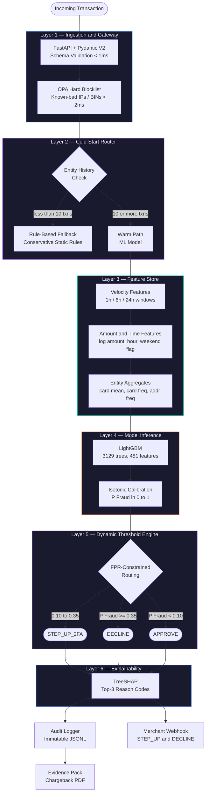
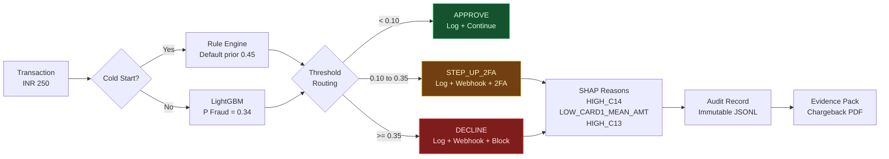
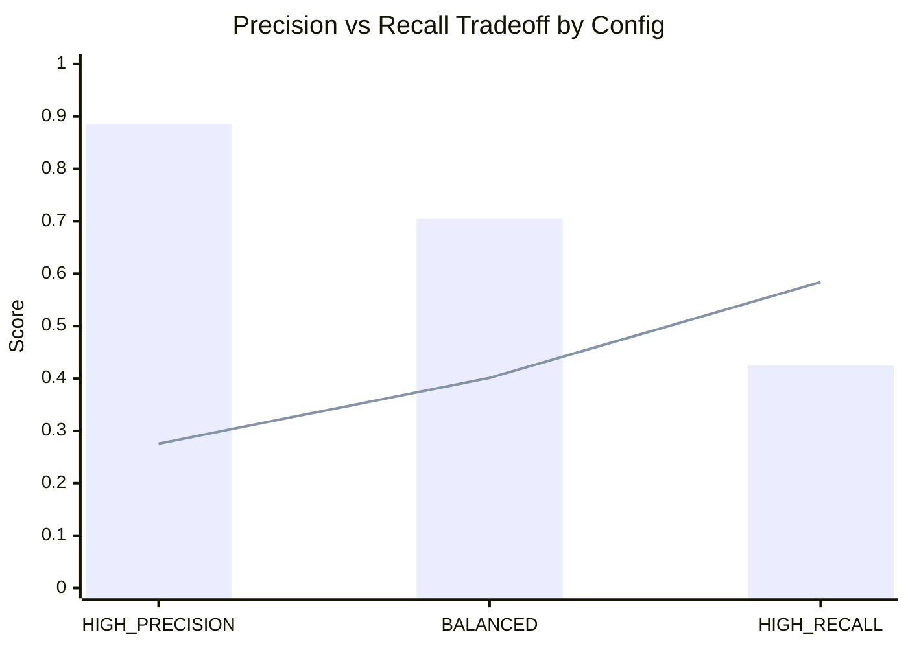
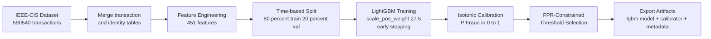

<div align="center">


# AI Risk Manager

**Real-time fraud detection with explainable decisions, cold-start handling, and full Razorpay test-mode integration.**

Track 02 — AI Risk Manager | AI Buildathon 2026

---


</div>

---

## Overview

AI Risk Manager is a production-grade fraud detection system that scores transactions in real time, generates explainable decisions with SHAP reason codes, and integrates directly with Razorpay's test-mode API. Every decision is logged to an immutable audit trail and can be exported as a chargeback evidence pack.

The system handles the full fraud detection lifecycle — from transaction ingestion and feature engineering, through ML inference and threshold routing, to merchant webhook delivery and drift monitoring.

---

## Evaluation Metrics

Evaluated on the IEEE-CIS Fraud Detection dataset, held-out validation set of 118,108 transactions.

| Metric | HIGH_PRECISION | BALANCED |
|---|---|---|
| AUC-ROC | 0.9187 | 0.9187 |
| Precision | **0.8854** | 0.7047 |
| Recall | 0.2756 | 0.4011 |
| False Positive Rate | **0.0013** | 0.0060 |
| F1 Score | 0.4198 | 0.5117 |

**Combined fraud coverage:** 66.6% of all fraud addressed (40.1% hard declined + 26.5% routed to 2FA)

**False positives in HIGH_PRECISION mode:** 145 legitimate transactions wrongly declined out of 114,044 (0.13%)

**Model:** LightGBM, 3,129 trees, 451 features, isotonic calibration

**Training set:** 472,432 transactions | **Validation set:** 118,108 transactions

---

## Pipeline Architecture



---

## Decision Flow



---

## Threshold Operating Configs



---

## Repo Structure

```
razorpay-ai-risk-manager/
├── api/
│   └── main.py                  FastAPI server — /score /batch /health /audit /razorpay
├── artifacts/
│   ├── lgbm_risk_model.txt      Trained LightGBM booster (3129 trees)
│   ├── isotonic_calibrator.pkl  Isotonic regression calibrator
│   └── model_metadata.json      Thresholds, eval metrics, feature list
├── audit/
│   ├── logger.py                Append-only JSONL decision log
│   └── evidence.py              Chargeback evidence pack generator
├── batch/
│   └── scorer.py                CSV upload batch scorer with SHAP reasons
├── coldstart/
│   └── fallback.py              Rule-based fallback for new entities
├── dashboard/
│   └── app.py                   Streamlit ops panel — 6 tabs
├── docker/
│   ├── Dockerfile               API container
│   └── docker-compose.yml       API + dashboard compose
├── docs/
│   ├── architecture.md          This document
│   └── architecture.png         Pipeline diagram
├── mlops/
│   └── drift.py                 PSI + KL divergence drift detection
├── notebooks/
│   └── ai-risk-manager.ipynb    Training pipeline — IEEE-CIS dataset
├── outputs/
│   ├── eda_snapshot.png         Dataset overview
│   ├── evaluation_charts.png    ROC, PR curve, score distribution
│   └── shap_importance.png      SHAP feature importance
├── rzp/
│   ├── client.py                Razorpay API client — rzp_test_ keys
│   └── orders.py                Order creation and fetching
├── tests/
│   ├── test_api.py              API endpoint tests — 30 tests
│   ├── test_threshold.py        Threshold routing tests — 15 tests
│   └── test_audit.py            Audit logger tests — 10 tests
├── webhooks/
│   └── merchant.py              Fires webhooks on STEP_UP and DECLINE
├── .env.example                 Credentials template
├── requirements.txt
└── README.md
```

---

## Quick Start

**Prerequisites:** Python 3.12, pip, a Razorpay test account

```bash
# 1. Clone the repository
git clone https://github.com/sumitchopkar2005/AI_Risk_Manager.git
cd AI_Risk_Manager

# 2. Create virtual environment
python -m venv venv
venv\Scripts\activate       # Windows
# source venv/bin/activate  # Mac / Linux

# 3. Install dependencies
pip install -r requirements.txt

# 4. Add Razorpay credentials
cp .env.example .env
# Edit .env with your rzp_test_* keys from dashboard.razorpay.com/app/keys

# 5. Run the API
uvicorn api.main:app --reload --port 8000

# 6. Run the dashboard (new terminal)
streamlit run dashboard/app.py

# 7. Run the test suite (new terminal)
pytest tests/ -v
```

API docs available at `http://localhost:8000/docs`

Dashboard available at `http://localhost:8501`

---

## API Reference

### Score a transaction

```bash
POST /score
```

```json
{
  "TransactionAmt": 250.0,
  "card1": 9500,
  "hour_of_day": 14,
  "day_of_week": 2,
  "is_cold_start": 0,
  "card1_vel_3600s": 3.0,
  "card1_vel_21600s": 8.0,
  "card1_vel_86400s": 15.0,
  "merchant_id": "merchant_123",
  "order_id": "order_TTwcmGyJ2hWTFv"
}
```

**Response:**

```json
{
  "transaction_id": "35535090-344",
  "p_fraud": 0.3443,
  "decision": "STEP_UP_2FA",
  "reasons": ["HIGH_C14", "LOW_CARD1_MEAN_AMT", "HIGH_C13"],
  "path": "ML_MODEL",
  "model_ver": "lgbm-v1.0",
  "latency_ms": 27.51,
  "audit": {
    "order_id": "order_TTwcmGyJ2hWTFv",
    "merchant_id": "merchant_123",
    "amount": 250.0,
    "decision": "STEP_UP_2FA",
    "thresholds": {
      "approve": 0.1,
      "stepup": 0.35,
      "decline": 0.35
    }
  }
}
```

### Create a Razorpay test order

```bash
POST /razorpay/create-order?amount_inr=250&merchant_id=merchant_123
```

### Batch score from CSV

```bash
POST /batch
Content-Type: application/json

[
  { "TransactionAmt": 250.0, "card1": 9500 },
  { "TransactionAmt": 1500.0, "card1": 1234 }
]
```

### Audit history

```bash
GET /audit/history?limit=50
GET /audit/stats?hours=24
```

### Health check

```bash
GET /health
```

```json
{
  "status": "ok",
  "model_ver": "lgbm-v1.0",
  "razorpay_connected": true,
  "thresholds": { "approve": 0.1, "stepup": 0.35, "decline": 0.35 }
}
```

---

## Dashboard

The Streamlit ops panel has 6 tabs:

| Tab | Description |
|---|---|
| Live Dashboard | Real-time fraud rate, decision breakdown, fraud score gauge, recent decisions |
| Score Transaction | Interactive scoring form with Razorpay order creation and SHAP reasons |
| Audit History | Filterable decision log with CSV download |
| Model Info | Eval metrics, threshold config, architecture summary |
| Batch Scorer | CSV upload — scored table with SHAP reasons per row and distribution chart |
| Drift Monitor | PSI and KL divergence monitoring with retrain alert and score means chart |

---

## Feature Engineering

Features engineered on top of the raw IEEE-CIS columns:

| Feature | Description |
|---|---|
| card1_vel_3600s | Card transaction count in last 1 hour |
| card1_vel_21600s | Card transaction count in last 6 hours |
| card1_vel_86400s | Card transaction count in last 24 hours |
| log_amount | Log-transformed transaction amount |
| amount_rounded | Binary flag — amount is a round number |
| amount_gt_500 | Binary flag — amount exceeds INR 500 |
| card1_mean_amt | Card-level mean transaction amount |
| card1_std_amt | Card-level standard deviation of amount |
| amt_vs_card_mean | Ratio of transaction amount to card mean |
| hour_of_day | Hour extracted from TransactionDT |
| is_night | Binary flag — transaction between 22:00 and 05:00 |
| is_weekend | Binary flag — Saturday or Sunday |
| risky_email_domain | Binary flag — protonmail, guerrillamail, tempmail, yopmail |
| email_match | Binary flag — P_emaildomain matches R_emaildomain |
| addr_mismatch | Binary flag — addr1 != addr2 |
| is_cold_start | Binary flag — entity has fewer than 10 historical transactions |
| card1_freq | Card-level transaction frequency encoding |
| card2_freq | Card2-level transaction frequency encoding |
| addr1_freq | Address-level transaction frequency encoding |

Plus all V (339), C (14), D (15), M (9), and id (41) columns from the raw dataset.

---

## Model Training



**Training configuration:**

```
Objective         : binary
Learning rate     : 0.01
Num leaves        : 31
Max depth         : 6
Min child samples : 100
Feature fraction  : 0.7
Bagging fraction  : 0.7
Scale pos weight  : 27.5 (neg / pos ratio)
Best iteration    : 3129 (early stopping at round 3129)
```

---

## Drift Detection

The `mlops/drift.py` module computes PSI (Population Stability Index) between a 7-day reference window and a 24-hour recent window.

```
PSI < 0.1   —  Stable, no action needed
PSI 0.1-0.2 —  Monitor, watch closely
PSI > 0.2   —  Drift detected, retrain recommended
```

PSI is computed as:

```
PSI = sum((actual_pct - expected_pct) * ln(actual_pct / expected_pct))
```

KL divergence is computed as a complementary signal:

```
KL = sum(p * ln(p / q))
```

---

## Cold-Start Handling

New entities with fewer than 10 historical transactions bypass the ML model and are scored by a conservative rule engine:

| Condition | Risk Adjustment |
|---|---|
| Default prior | P(Fraud) = 0.45 |
| Amount exceeds limit (INR 500) | P(Fraud) = max(current, 0.78) |
| Night-time transaction | Limit reduced to INR 350, P(Fraud) += 0.10 |
| Risky email domain | P(Fraud) = max(current, 0.85) |
| P(Fraud) ceiling | 0.95 |

Warm-up threshold: 10 transactions. After 10 transactions the entity graduates to the ML model path.

---

## Test Suite

```
51 tests — 0 failures

tests/test_api.py          30 tests
  TestHealth               4 tests  — /health schema, Razorpay connection
  TestScore                9 tests  — schema, p_fraud range, latency, 422 validation
  TestColdStart            3 tests  — path routing, rule triggers
  TestThresholds           2 tests  — high risk routing, decision consistency
  TestAudit                5 tests  — stats, history, audit record creation
  TestBatch                3 tests  — 200 response, summary count, results count

tests/test_threshold.py    13 tests
  TestThresholdLogic        8 tests  — boundary conditions, all decisions covered
  TestColdStartRules        7 tests  — risk adjustments, reason codes, caps

tests/test_audit.py        10 tests
  TestAuditLogger          10 tests  — log, retrieve, filter, stats, append-only
```

Run with:

```bash
pytest tests/ -v
```

---

## Docker

```bash
# Build and run API
docker build -t razorpay-risk-api .
docker run -p 8000:8000 --env-file .env razorpay-risk-api

# Or run full stack with compose
docker-compose -f docker/docker-compose.yml up
```

---

## Dataset

**IEEE-CIS Fraud Detection** — Kaggle competition dataset

| Property | Value |
|---|---|
| Total transactions | 590,540 |
| Fraud rate | 3.50% (20,663 frauds) |
| Features after merge | 434 raw + 17 engineered = 451 total |
| Train size | 472,432 transactions |
| Validation size | 118,108 transactions |
| Split method | Time-based (no shuffle) |
| Cold-start transactions | 28,052 (4.8%) |

---

## Tech Stack

| Layer | Technology |
|---|---|
| API | FastAPI 0.111, Uvicorn, Pydantic V2 |
| Model | LightGBM 4.3.0, scikit-learn 1.4.2 |
| Explainability | SHAP 0.45 (TreeSHAP) |
| Calibration | Isotonic Regression |
| Dashboard | Streamlit 1.35, Plotly |
| Payments | Razorpay Python SDK |
| Audit | Append-only JSONL |
| Drift | PSI + KL Divergence (numpy) |
| Tests | pytest 9.1.1 |
| Container | Docker, docker-compose |
| Language | Python 3.12 |

---

## Environment Variables

Copy `.env.example` to `.env` and fill in your credentials:

```bash
cp .env.example .env
```

| Variable | Description | Where to get it |
|---|---|---|
| RAZORPAY_KEY_ID | Test-mode key ID | dashboard.razorpay.com/app/keys |
| RAZORPAY_KEY_SECRET | Test-mode key secret | dashboard.razorpay.com/app/keys |

Never commit `.env` to version control. It is listed in `.gitignore`.

---

## What is Built vs What is Planned

| Component | Status | Notes |
|---|---|---|
| LightGBM training pipeline | Built | IEEE-CIS, 451 features, isotonic calibration |
| Cold-start rule engine | Built | Conservative fallback for < 10 txn entities |
| Dynamic threshold routing | Built | 3 configs, FPR ceiling enforced |
| FastAPI inference server | Built | /score /batch /health /audit /razorpay |
| Razorpay test-mode integration | Built | Real orders via rzp_test_ keys |
| Merchant webhooks | Built | Fires on STEP_UP and DECLINE |
| Immutable audit logger | Built | Append-only JSONL |
| Chargeback evidence packs | Built | Auto-generated text reports |
| Streamlit ops dashboard | Built | 6 tabs including drift monitor |
| Batch CSV scorer | Built | SHAP reasons per row |
| PSI drift detection | Built | 7-day vs 24-hour comparison |
| Unit tests | Built | 51 tests, 0 failures |
| Docker containerization | Built | API + dashboard |
| GraphSAGE graph model | Planned | Syndicate and mule ring detection |
| Redis live feature store | Planned | Real-time velocity computation |
| ClickHouse event log | Planned | Long-term storage for retraining |
| Automated retraining pipeline | Planned | Triggered when PSI exceeds 0.2 |

---

## Author

**Sumit Chopkar**
AI Buildathon 2026 — Track 02: AI Risk Manager
GitHub: [SumitChopkar](https://github.com/sumitchopkar2005)

---

<div align="center">

Built for Razorpay AI Buildathon 2026

</div>
